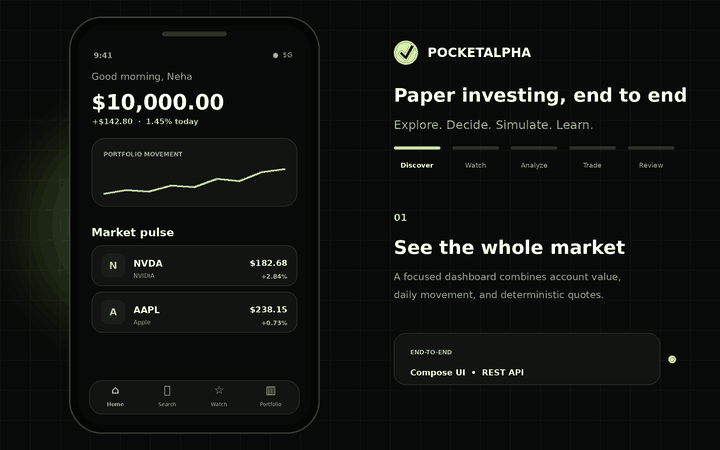
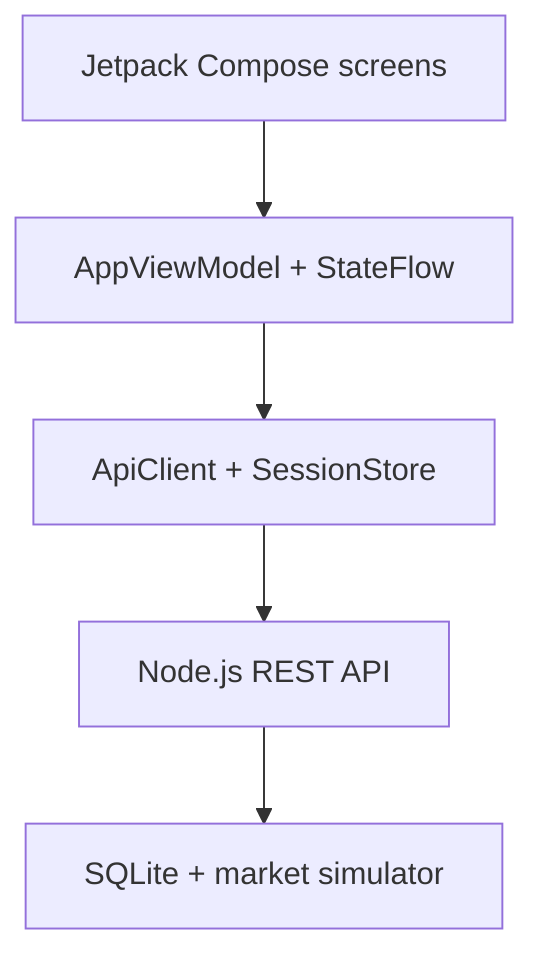
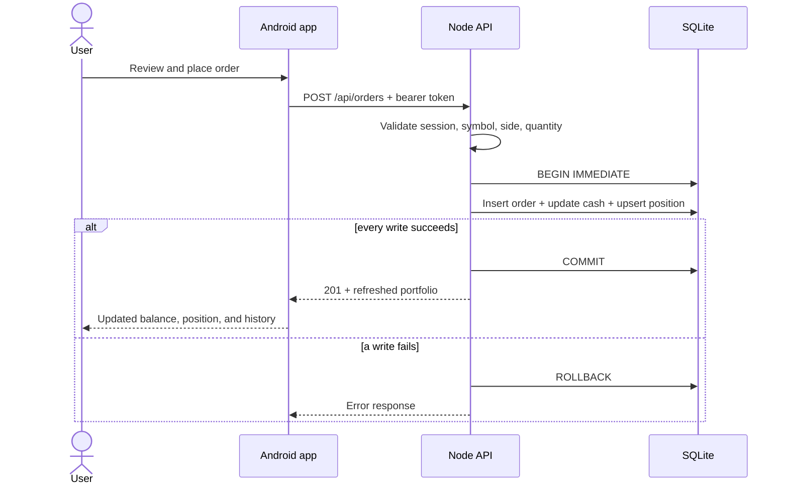
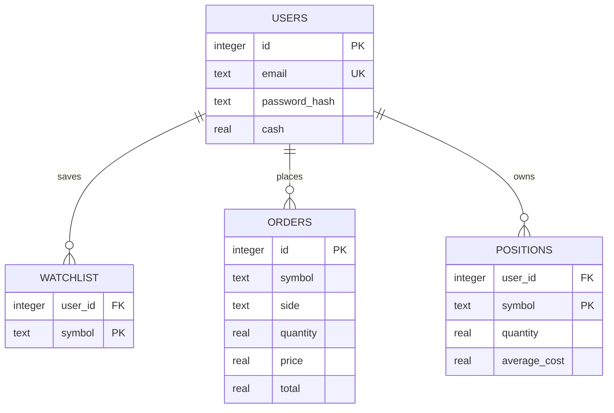

<div align="center">

# PocketAlpha

### A native Android paper-investing experience, built end to end.

Explore the market, build a watchlist, inspect price history, execute simulated orders, and track portfolio performance—all through one cohesive mobile flow.

[](https://kotlinlang.org/)
[](https://developer.android.com/compose)
[](https://nodejs.org/)
[](https://sqlite.org/)

[](https://github.com/mneha05/PocketAlpha/actions/workflows/backend-tests.yml)


</div>

<p align="center">
  
</p>

<p align="center">
  <a href="#the-product-loop">Product</a> ·
  <a href="#system-design">Architecture</a> ·
  <a href="#api-surface">API</a> ·
  <a href="#run-it-locally">Run locally</a> ·
  <a href="#verification">Tests</a> ·
  <a href="#deployment">Deploy</a>
</p>

---

## The product loop

PocketAlpha begins each account with **$10,000 in simulated cash** and turns a market idea into a complete, persistent workflow.

| Step | Experience | What happens behind the screen |
|---:|---|---|
| **01** | **Discover** stocks and market movers | Public market endpoints produce stable, deterministic quote snapshots without requiring a paid data key. |
| **02** | **Save** interesting symbols | The authenticated watchlist is scoped to the current user and persisted in SQLite. |
| **03** | **Analyze** an asset | Range-aware history data is rendered as a custom chart with Compose Canvas. |
| **04** | **Trade** with simulated funds | The API validates symbol, side, quantity, buying power, and owned shares before writing anything. |
| **05** | **Review** the result | Cash, positions, weighted average cost, gains/losses, and recent orders are recalculated and returned together. |

The Android experience includes launch, authentication, loading, empty, error, retry, success, and signed-out states—not only the happy path.

## System design

The mobile client owns presentation and interaction state. The server remains the source of truth for identity, balances, positions, and orders.



### A paper order, end to end



This boundary matters: the app never calculates an authoritative balance locally. After an order succeeds, it renders the portfolio snapshot returned by the same server transaction.

### Persistent data model



## Engineering highlights

| Area | Implementation | Why it matters |
|---|---|---|
| **State-driven Android UI** | A single immutable `PocketAlphaState`, exposed with `StateFlow` | Screens react predictably to async network, session, selection, and feedback changes. |
| **Responsive search** | A cancellable coroutine job with a 250 ms debounce | Superseded searches do not continue producing stale work. |
| **Native visualization** | Price history drawn with Compose Canvas | Keeps the chart lightweight and fully integrated with the design system. |
| **Authentication** | Per-user salted `scrypt` hashes plus HMAC-signed, 24-hour bearer tokens | Passwords are never stored in plaintext; protected routes share one verification path. |
| **Order integrity** | Server-side validation inside a SQLite `BEGIN IMMEDIATE` transaction | The order, cash balance, and position cannot partially diverge. |
| **Portfolio accounting** | Weighted average cost on buys; ownership checks on sells | Positions remain internally consistent across repeated orders. |
| **Persistence** | Foreign keys, composite keys, cascading deletes, and WAL mode | Relationships are enforced by the database and local writes remain reliable. |
| **Portable backend** | Node's built-in HTTP, crypto, test, and SQLite modules | The entire API runs with zero third-party runtime dependencies. |

<details>
<summary><strong>How authentication works</strong></summary>

1. Registration normalizes the email, validates the payload, generates a random salt, and stores an `scrypt` password hash.
2. Login compares hashes with a timing-safe equality check.
3. The API signs `{ sub, exp }` with HMAC-SHA256 and returns a 24-hour bearer token.
4. Android saves the token in `SharedPreferences` through `SessionStore` and attaches it only to protected requests.
5. Bootstrap verifies the saved session through `/api/me`; an invalid or expired session is cleared before returning to sign-in.

</details>

<details>
<summary><strong>Why the market data is deterministic</strong></summary>

PocketAlpha deliberately uses a simulated market engine instead of disguising hard-coded values as live data. Symbol-specific waves, trends, and time-based drift make every screen functional while keeping local development repeatable, offline-friendly, and free of API keys.

The boundary is replaceable: `quoteFor`, `currentPrice`, and `historyFor` can be moved behind a provider interface without changing the Android screen contract.

</details>

## API surface

Public routes power discovery; private routes require `Authorization: Bearer <token>`.

| Method | Route | Auth | Purpose |
|---|---|:---:|---|
| `GET` | `/health` | — | Service health and timestamp |
| `POST` | `/api/auth/register` | — | Create an account and starter watchlist |
| `POST` | `/api/auth/login` | — | Verify credentials and issue a session |
| `GET` | `/api/market/overview` | — | Indices, movers, data source, and as-of time |
| `GET` | `/api/quotes?query=nvda` | — | Search by symbol or company name |
| `GET` | `/api/quotes?symbols=AAPL,NVDA` | — | Fetch a specific symbol set |
| `GET` | `/api/stocks/:symbol/history?range=1M` | — | Quote plus chart points for `1D`, `1W`, `1M`, `3M`, or `1Y` |
| `GET` | `/api/me` | ✓ | Restore the current session |
| `GET` | `/api/watchlist` | ✓ | Fetch saved symbols with current quotes |
| `POST` | `/api/watchlist` | ✓ | Add a symbol idempotently |
| `DELETE` | `/api/watchlist/:symbol` | ✓ | Remove a saved symbol |
| `GET` | `/api/portfolio` | ✓ | Cash, holdings, positions, P/L, and recent orders |
| `POST` | `/api/orders` | ✓ | Execute a validated paper buy or sell |

<details>
<summary><strong>Example: register, authenticate, and buy</strong></summary>

```bash
# Create an account
curl -s http://localhost:8080/api/auth/register \
  -H 'content-type: application/json' \
  -d '{"name":"Ada","email":"ada@example.com","password":"StrongPass123!"}'

# Use the returned token to place a simulated order
curl -s http://localhost:8080/api/orders \
  -X POST \
  -H 'content-type: application/json' \
  -H 'authorization: Bearer YOUR_TOKEN' \
  -d '{"symbol":"NVDA","side":"BUY","quantity":2}'
```

</details>

## Run it locally

### 1. Start the API

Node.js **22.5+** is required for the built-in `node:sqlite` module; CI runs on Node 24.

```bash
cd backend
npm start
```

The service starts at `http://localhost:8080`. No package installation is required.

Verify it:

```bash
curl http://localhost:8080/health
```

### 2. Run Android

1. Open the `android/` directory in Android Studio.
2. Let Gradle sync with JDK 17 or newer.
3. Start an emulator running API 26 or newer.
4. Run the `app` configuration.

The emulator reaches the host API through `http://10.0.2.2:8080/api/`. For a physical device, change `BuildConfig.API_BASE_URL` in `android/app/build.gradle.kts` to the development machine's LAN address.

<details>
<summary><strong>Demo account</strong></summary>

When the standalone server starts, it creates this account if it does not exist:

```text
Email:    demo@pocketalpha.app
Password: DemoPass123!
```

The credentials are intended for local demonstration only.

</details>

## Verification

The integration suite boots the real HTTP server against an isolated in-memory SQLite database.

```bash
cd backend
npm test
```

It verifies:

- health and public market responses;
- registration, duplicate-account rejection, and login;
- authenticated watchlist persistence;
- buy, oversell rejection, and sell flows;
- missing-session and invalid-order failures.

Every push and pull request also runs the suite through [GitHub Actions](.github/workflows/backend-tests.yml).

## Deployment

The backend is ready for a Docker-based Railway service:

1. Create a Railway service from this repository.
2. Set the root directory to `backend`.
3. Add a strong, randomly generated `AUTH_SECRET`.
4. Set `DB_PATH` to a path on a mounted persistent volume, such as `/data/pocketalpha.db`.
5. Railway builds [`backend/Dockerfile`](backend/Dockerfile) and checks `GET /health` using [`backend/railway.json`](backend/railway.json).
6. Replace `API_BASE_URL` in [`android/app/build.gradle.kts`](android/app/build.gradle.kts) with the generated HTTPS domain before producing a release build.

```text
AUTH_SECRET=<long-random-production-secret>
DB_PATH=/data/pocketalpha.db
```

The Android client is a native application, so deployment means distributing an APK/App Bundle after pointing it at the hosted API—not publishing it as a web page.

## Project map

<details>
<summary><strong>Open the repository structure</strong></summary>

```text
PocketAlpha/
├── android/
│   ├── app/src/main/java/com/nehamahesh/pocketalpha/
│   │   ├── ApiClient.kt        # HTTP transport + JSON mapping + session store
│   │   ├── AppViewModel.kt     # StateFlow state and user actions
│   │   ├── Components.kt       # Reusable Compose UI and chart primitives
│   │   ├── Models.kt           # App data contracts
│   │   ├── Screens.kt          # Auth, home, search, watchlist, detail, trade
│   │   ├── Theme.kt            # PocketAlpha color and typography system
│   │   └── MainActivity.kt     # Android entry point
│   └── app/build.gradle.kts    # SDK, Compose, and API endpoint configuration
├── backend/
│   ├── server.mjs              # HTTP API, auth, market engine, persistence
│   ├── test/api.test.mjs       # End-to-end API integration tests
│   ├── Dockerfile              # Production container
│   └── railway.json            # Health check and restart policy
├── docs/
│   ├── assets/                 # README media
│   └── generate_demo.py        # Reproducible animated tour generator
└── .github/workflows/          # Continuous integration
```

</details>

## Production hardening

This repository is intentionally a focused paper-trading system. Before adapting the architecture to handle sensitive or regulated workloads, add managed identity or refresh-token rotation, platform-backed Android credential storage, rate limiting, structured audit logs, decimal-based money arithmetic, idempotency keys, observability, migrations, and a managed production database.

---

<p align="center">
  <strong>Built for learning, not financial decisions.</strong><br/>
  PocketAlpha uses simulated prices, simulated funds, and no brokerage connectivity.
</p>
